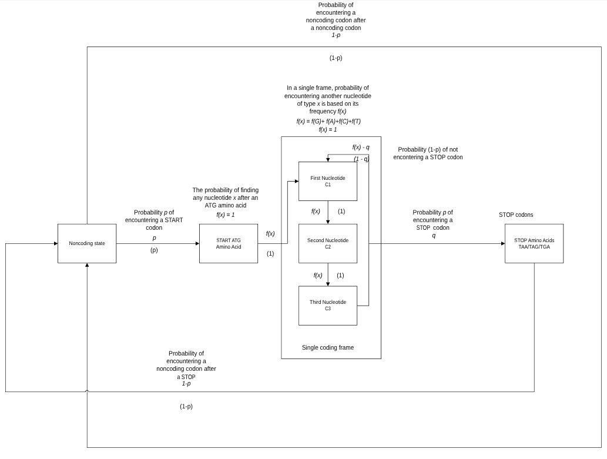
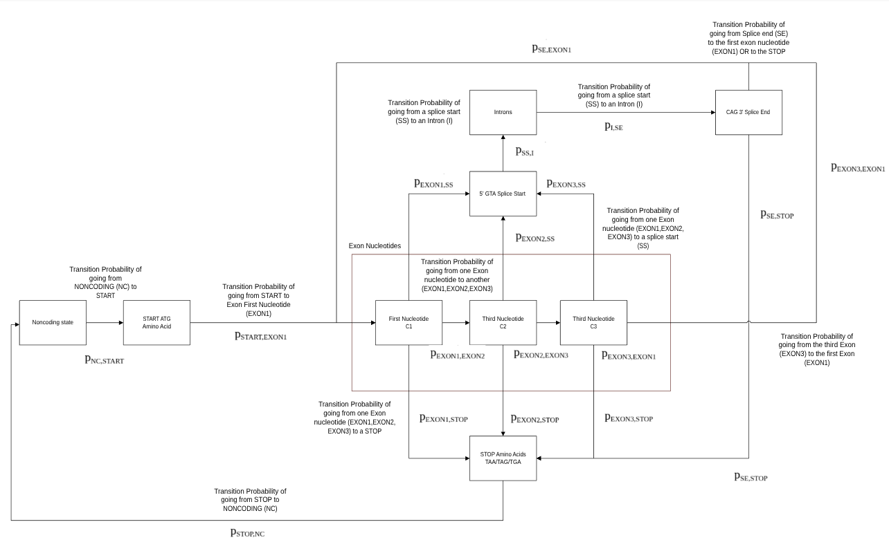

# Hidden Markov Model Genome Analysis Programs

This repository contains two Hidden Markov Model (HMM)-based bioinformatics programs developed using Object Pascal (Free Pascal/Lazarus) for genomic sequence analysis.

---

## 1. HMM ORF Finder

The first program is an HMM-based Open Reading Frame (ORF) finder designed for prokaryotic bacterial genome sequences. The application analyzes nucleotide sequences to identify potential protein-coding regions by scanning reading frames, detecting start and stop codons, and comparing coding versus non-coding probabilities using Hidden Markov Model state transitions.

### State Transition Diagram

---

## 2. HMM Intron Splicer

The second program is an HMM-based intron splicing simulator for eukaryotic genomic sequences. The application identifies exon and intron regions using donor (`GTA`) and acceptor (`CAG`) splice-site motifs, separates introns from exons, and reconstructs the final spliced mRNA sequence.

### State Transition Diagram

---

## Features

- Hidden Markov Model-based sequence analysis
- ORF prediction for bacterial genomes
- Exon–intron segmentation and mRNA splicing simulation
- FASTA-compatible nucleotide sequence processing
- Graphical User Interface (GUI) using Lazarus/Free Pascal
- State transition modeling and visualization

---

## Technologies Used

- Object Pascal
- Lazarus IDE
- Free Pascal Compiler (FPC)
